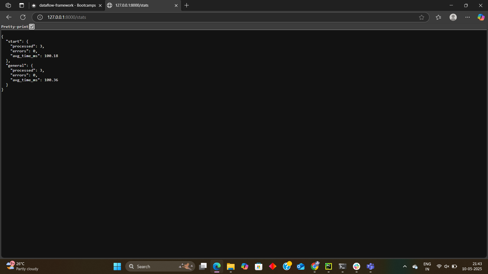
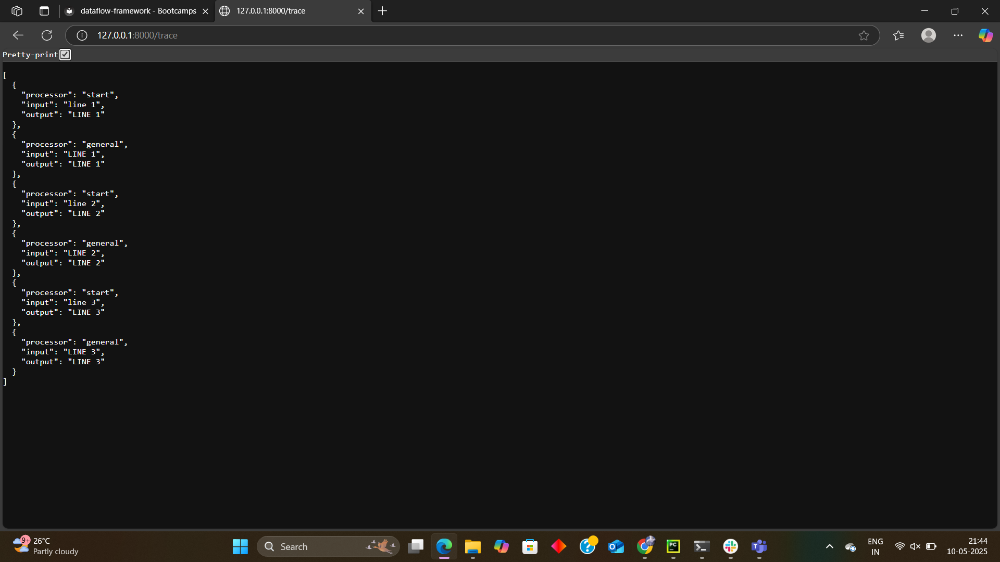
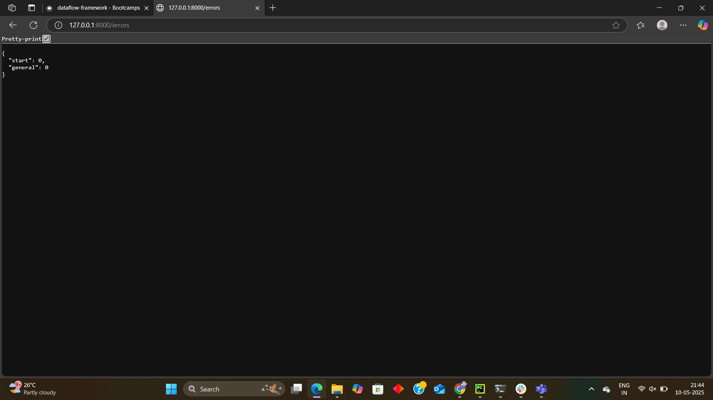

🧠 Log Processing Engine with Real-Time Observability
This project is a real-time log processing engine built in Python. It includes metrics tracking, trace collection, and a live web dashboard using FastAPI — making it easier to observe, introspect, and operate the system like a real-world service.

🚀 Overview
The system processes lines of text using a configurable sequence of processors (start, warn, error, general). While processing:

It tracks metrics like processing time and line counts.

It traces the journey of each line through the system.

It exposes a FastAPI dashboard that displays live stats, traces, and errors.

📦 Features
✅ Metrics Layer
Count of lines processed per processor

Average processing time per processor

Number of exceptions raised by each processor

🔍 Execution Tracing
Each processed line stores its trace path (e.g., ["start", "general"])

Supports up to the last 1000 traces

Controlled by a CLI flag (optional in future)

🌐 Web Dashboard
Built with FastAPI and runs in a background thread

Non-blocking – processing continues alongside the server

Exposes the following endpoints:

/stats – live processor metrics

/trace – most recent 100 traces

/errors – processor-level error logs

🧵 Concurrency Design
Shared state is safely updated using built-in data structures

Dashboard runs using Python's threading.Thread

System remains responsive even under load

⚙️ How to Run
1. Clone the Repository
bash
Copy code
git clone https://github.com/sejal1234desai/log-observability-system.git
cd log-observability-system
2. Create and Activate Virtual Environment
bash
Copy code
uv venv venv
source venv/bin/activate   # On Windows: venv\Scripts\activate
3. Install Dependencies
bash
pip install fastapi uvicorn
4. Run the System
bash

python run.py
This will:

Start processing test lines (line 1, line 2, line 3)

Launch the FastAPI dashboard on http://127.0.0.1:8000

🔎 Example Outputs
/stats
json
Copy code
{
  "start": {"processed": 3, "errors": 0, "avg_time_ms": 100.1},
  "general": {"processed": 3, "errors": 0, "avg_time_ms": 99.9}
}
/trace
json
Copy code
[
  ["start", "general"],
  ["start", "general"],
  ["start", "general"]
]
/errors
json
Copy code
{
  "start": 0,
  "general": 0
}

## 📊 Dashboard Preview

### 🔧 Stats Page

### 🔍 Trace Page

### ❗ Error Page

💡 Design Philosophy
This project is inspired by real-world systems like:

Apache Spark UI

Apache Airflow DAGs

Prometheus + Grafana

Kubernetes Dashboard

The goal is not just to build a processor, but to observe, understand, and operate it — a step toward real-world engineering and monitoring.

📝 Future Improvements
Add support for retries and error recovery

Persist metrics and traces to disk

Enable/disable tracing via command-line argument

HTML/JS frontend for better visualization

👨‍🔧 Reflection
While building this, I learned:

How to use shared memory across threads

How to design live dashboards for backend systems

Importance of observability in production-like pipelines

In a real distributed setup, I’d want to:

Collect metrics centrally using Prometheus

Visualize with Grafana

Use distributed tracing (like OpenTelemetry)
